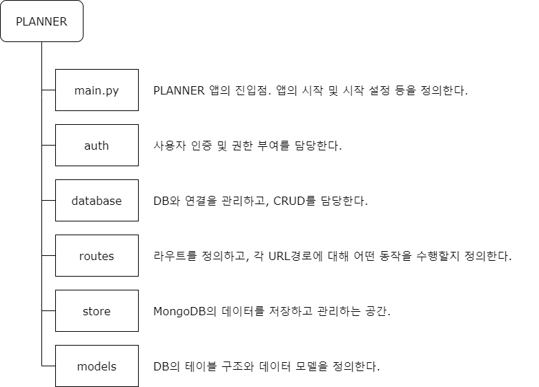

# PLANNER

## 1. App architecture

### 1.1 auth

## beanie
- beanie==1.13.1  # beanie 1.13.1 버전에서 작성
- Beanie - is an asynchronous Python object-document mapper (ODM) for MongoDB. Data models are based on Pydantic.

## mongodb
- 7.0.4 ver(2023-12-28 기준)
- Platform: Windows x64
- Package: msi
- [다운로드 페이지](https://www.mongodb.com/try/download/community)
